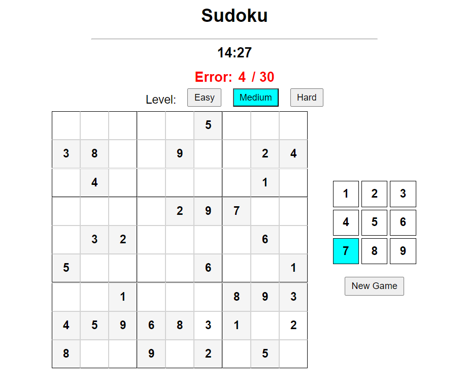

# Sudoku - Javascript Project

## Overview

This project is a Sudoku game implemented in JavaScript, HTML and CSS. It generates a Sudoku puzzle, validates user input, and checks for completion. The game includes functionality for different difficulty levels, a timer, and an error counter to enhance the gaming experience.

URL: https://ryoko-yamamoto.github.io/javascript-sudoku/

## Author

Created by Ryoko Yamamoto,
Robinson,
Joao,

**Note:** This README file has been edited.
